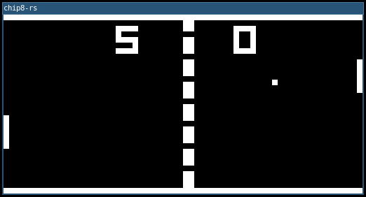
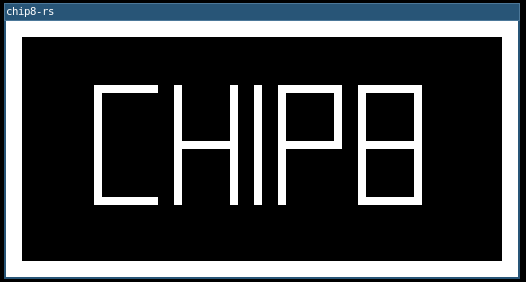
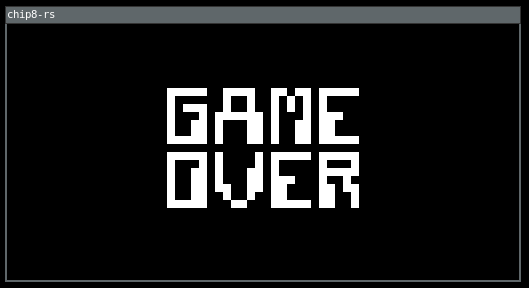
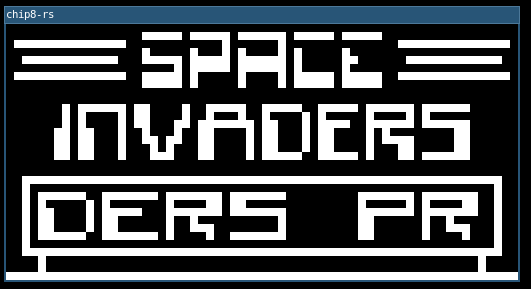

# chip8-rs

CHIP-8 emulator written in Rust.

*(Done with the Go implementation: https://github.com/arnaucube/go-chip8)*

https://en.wikipedia.org/wiki/CHIP-8

## Usage
```
./chip8-rs --file roms/invaders.c8
```





